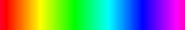
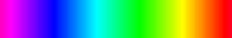
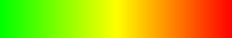

# Overview of Files

## `voxblox_rnm_*.launch`

Choose one of these files to start the [3D Radiation Mapper](https://git.sim.informatik.tu-darmstadt.de/hector/hector_voxblox/-/tree/radio_nuclear_mapper). It was built into Voxblox ([original repository](https://github.com/ethz-asl/voxblox)) as an extra node. Therefore, make sure that you have selected the right branches before you start.

| Repository | Branch |
|:-:|:-:|
| **voxblox** | [radio_nuclear_mapper](https://git.sim.informatik.tu-darmstadt.de/hector/hector_voxblox/-/tree/radio_nuclear_mapper) |
| **radiological_nuclear_mapper** | [voxblox](https://git.sim.informatik.tu-darmstadt.de/hector/hector_enrich/-/tree/voxblox/radiological_nuclear_mapper) |
| **hector_vehicle_launch** (this repository) | [radiological_nuclear_mapper](https://github.com/tu-darmstadt-ros-pkg/hector_vehicle_launch/tree/radiological_nuclear_mapper) (this branch) |

### Radionuclear Mapper Specific Parameters

#### `radiation_sensor_topic`
**Type:** String.
Defines the ROS topic which is used to receive the intensity values from the radiation sensor. 

#### `radiation_sensor_frame_id`
**Type:** String.
Defines the ID of the frame, which describes the position at the robot arm where the sensor is mounted. 

#### `radiation_max_distance`
**Type:** Float.
**Default:** Max. distance value of TSDF integrator.
Defines the maximum distance up to which the measured radiation intensity should be projected onto surrounding surfaces.

#### `radiation_distance_function`
**Type:** String.
**Default:** `"constant"`.
Defines the function which describes the change of intensity with increasing distance to the sensor during projection on surrounding surfaces. The following functions are available.
| Function Name | Parameter Value | Mathematical Description |
|:-:|:-:|:-:|
| Decreasing Radiation Distance Function | `"decreasing"` |  |
| Increasing Radiation Distance Function | `"increasing"` |  |
| Constant Radiation Distance Function | `"constant"` |  |

#### `radiation_use_logarithm`
**Type:** Boolean.
**Default:** `false`.
Defines whether the intensity represented as a colour gradient should be displayed logarithmically (`true`) or linear (`false`).

#### `radiation_msg_val_min`
**Type:** Float.
**Default:** `0.0`.
Defines the smallest value that the radiation sensor measures during the run. More information about the radiation sensor extreme values see [bellow](#radiation-sensor-extreme-values).

#### `radiation_msg_val_max`
**Type:** Float.
**Default:** `100000.0`.
Defines the largest value that the radiation sensor measures during the run. More information about the radiation sensor extreme values see [bellow](#radiation-sensor-extreme-values).

#### `radiation_bearing_vector_num`
**Type:** Integer.
**Default:** `10000`.
Defines the number of vectors starting at the position of the sensor along which the intensity is to be projected onto the surfaces.

#### `radiation_colormap`
**Type:** String.
**Default:** `"ironbow"`.
Defines the color map to display the radiation intensity. The following color maps are available.

| Parameter Value | Description |
|:-:|:-:|
| `"rainbow"` |  |
| `"inverse_rainbow"` |  |
| `"grayscale"` |  |
| `"inverse_grayscale"` |  |
| `"ironbow"` |  |
| `"traffic-light"`*  |  |

\* The traffic light colormap is added to the *radiological_nuclear_mapper* branch of *hector_vehicle_launch* repository for the purpose of displaying radiation intensities. It is recommended to use.

#### `save_mesh_trigger_topic`
**Type:** String.
Defines the ROS topic to receive the command that triggers the export of one or more meshes. See [here](https://git.sim.informatik.tu-darmstadt.de/hector/hector_voxblox/-/blob/radio_nuclear_mapper/README.md#3-how-to-export-3d-radiation-mesh) how to use it.

### Radiation Sensor Extreme Values

The parameters `radiation_msg_val_min` and `radiation_msg_val_max` are used to determine the color gradient for displaying the radiation intensity. This only affects the 3D map, which is gradually sent to rviz and displayed there. For this application, the minimum and maximum must obviously be known before the start. If the map is created by the playback ros bag files, the extreme values of intensity stored in the bag files can be read out using the [**Radiation Sensor Extreme Values Extractor**](https://git.sim.informatik.tu-darmstadt.de/hector/3d_radiation_mapper_tools/-/tree/master/radiation_sensor_extreme_values_extractor) before starting the 3D radiation mapper. The values that can be displayed in the color gradient as the lowest and highest intensity value are [calculated](https://git.sim.informatik.tu-darmstadt.de/hector/hector_voxblox/-/blob/radio_nuclear_mapper/voxblox_ros/src/radio_nuclear_mapper_server.cc#L204) by the specifications for the extreme values of the sensor (`radiation_msg_val_min` and `radiation_msg_val_max`) and the maximum mapping distance (`radiation_max_distance`).

These parameters do not affect the map that is exported. Here minimum and maximum are redefined according to the extreme values in the generated mesh. This ensures that the whole range of the color map is used.
